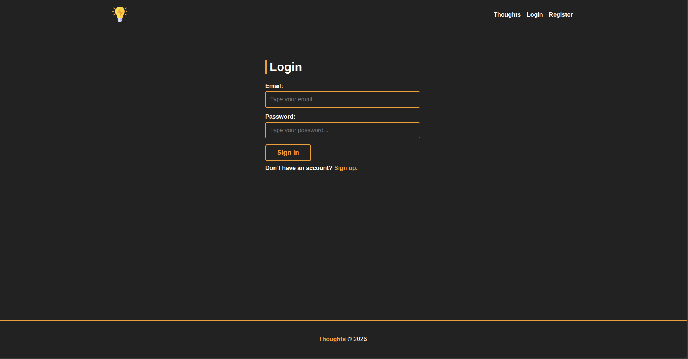
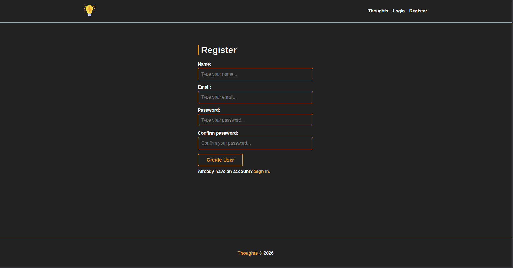
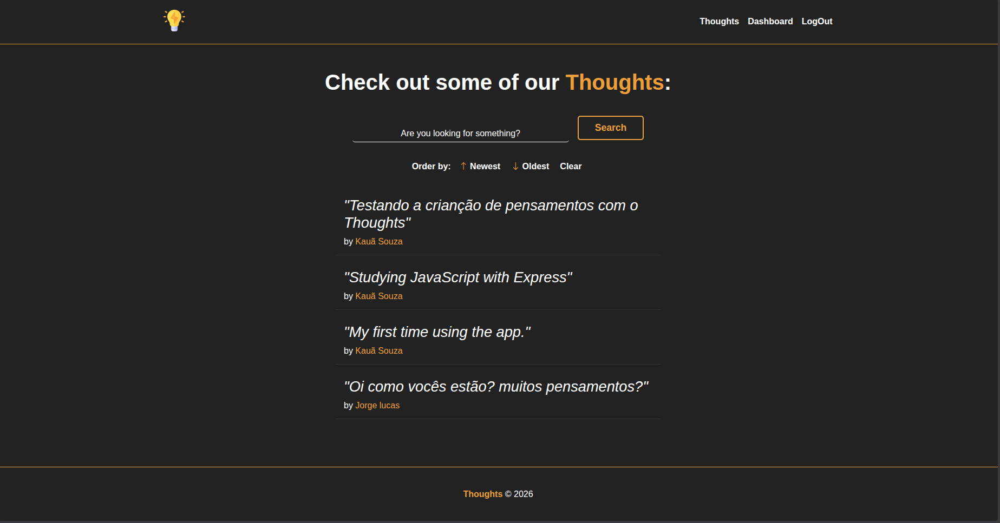
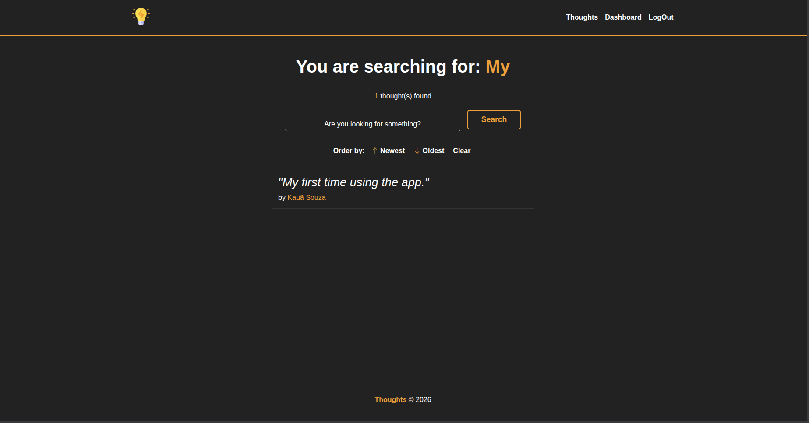
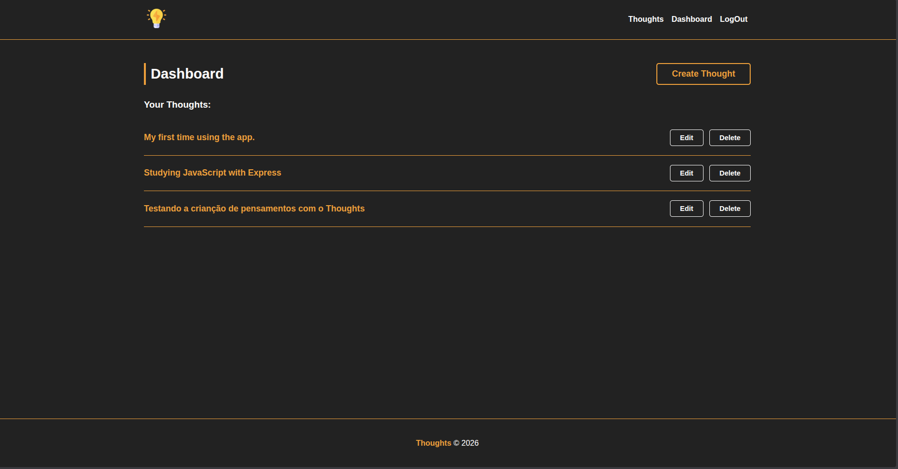
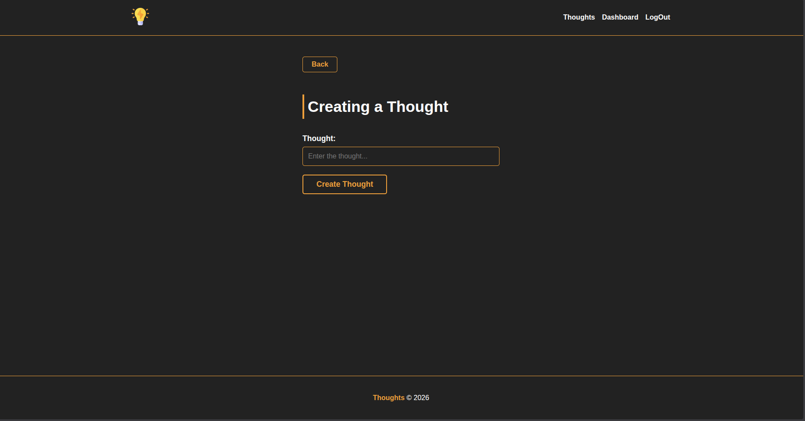

# 🧠 Thoughts- A Web Application for Managing Thoughts

Thoughts is a web application designed to help users manage their thoughts, ideas, and reflections in a structured and organized manner. The application provides a user-friendly interface for creating, editing, and deleting thoughts, as well as features for searching, sorting, and categorizing thoughts.

## 🚀 Features

- User authentication and authorization
- Thought creation, editing, and deletion
- Search and filtering functionality
- Sorting and categorization of thoughts
- User-friendly interface with responsive design
- Error handling and validation for user input
- Integration with a MySQL database using Sequelize

## 🛠️ Tech Stack

### Frontend

- Handlebars
- CSS
- JavaScript

### Backend

- Node.js
- Express.js

### Database & ORM

- MySQL
- Sequelize

### Authentication & Sessions

- express-session
- cookie-session
- session-file-store
- connect-flash

### Security & Validation

- argon2 (password hashing)
- validator

### Development Tools

- nodemon
- dotenv

## 🧠 Development Challenges

### Error Handling and Validation (Sequelize + Flash)

One of the main challenges in this project was integrating **Sequelize's native validations** with the **connect-flash** temporary messaging system.

#### The Problem

Sequelize returns an **array of error objects**, which made it difficult to display a **single, user-friendly message** on the frontend.

#### The Solution

To solve this, I implemented a **service layer (`RegisterModel`)** responsible for encapsulating the business logic.

Inside this layer, I created a helper function called **`catchErrors`**, which:

- Extracts the **first relevant error** from the Sequelize error array
- Converts it into a **clean string message**
- Sends this message to the **Controller**, which then forwards it to **Flash**

This approach:

- Improves **error readability for the end user**
- Keeps the **Controller cleaner**

## 📦 Installation

To install the project, follow these steps:

1. Clone the repository using `git clone`
2. Install the dependencies using `npm install`
3. Create a `.env` file with the following environment variables:
   - `DB_NAME`
   - `DB_USER`
   - `DB_PASSWORD`
   - `DB_HOST`
4. Run the application using `npm run dev`

## 💻 Usage

To use the application, follow these steps:

1. Start the development server using `npm run dev`
2. Open a web browser and navigate to `http://localhost:3000`
3. Register a new user account or log in to an existing account
4. Create, edit, and delete thoughts as needed
5. Use the search and filtering functionality to find specific thoughts

## 📂 Project Structure

```markdown
├── src
│ ├── controllers
│ │ ├── AuthController.js
│ │ ├── DashboardController.js
│ │ └── HomeController.js
│ │
│ ├── db
│ │ └── conn.js
│ │
│ ├── errors
│ │ └── catchError.js
│ │
│ ├── middlewares
│ │ ├── globalsMiddlewares.js
│ │ └── isAuthenticated.js
│ │
│ ├── models
│ │ ├── thoughtModels
│ │ │ ├── ThoughtManager.js
│ │ │ └── ThoughtModel.js
│ │ ├── LoginModel.js
│ │ ├── RegisterModel.js
│ │ └── UserModel.js
│ │
│ ├── routes
│ │ ├── auth.js
│ │ ├── dashboard.js
│ │ └── home.js
│ │
│ ├── public
│ │ ├── css
│ │ │ └── style.css
│ │ └── img
│ │ ├── favicon.ico
│ │ └── thoughts_logo.png
│ │
│ ├── sessions
│ │
│ ├── views
│ │ ├── dashboard
│ │ │ ├── create.handlebars
│ │ │ ├── dashboard.handlebars
│ │ │ └── edit.handlebars
│ │ │
│ │ ├── layouts
│ │ │ └── main.handlebars
│ │ │
│ │ ├── 404.handlebars
│ │ ├── error.handlebars
│ │ ├── home.handlebars
│ │ ├── login.handlebars
│ │ └── register.handlebars
│ │
│ └── server.js
│
└── package.json
```

### Architecture

The project follows a layered architecture inspired by MVC:

- **Controllers** handle HTTP requests and responses
- **Models** encapsulate business logic and database interaction
- **Routes** define application endpoints
- **Middlewares** manage authentication and global request handling
- **Views** render the UI using Handlebars templates

## 📸 Screenshots







